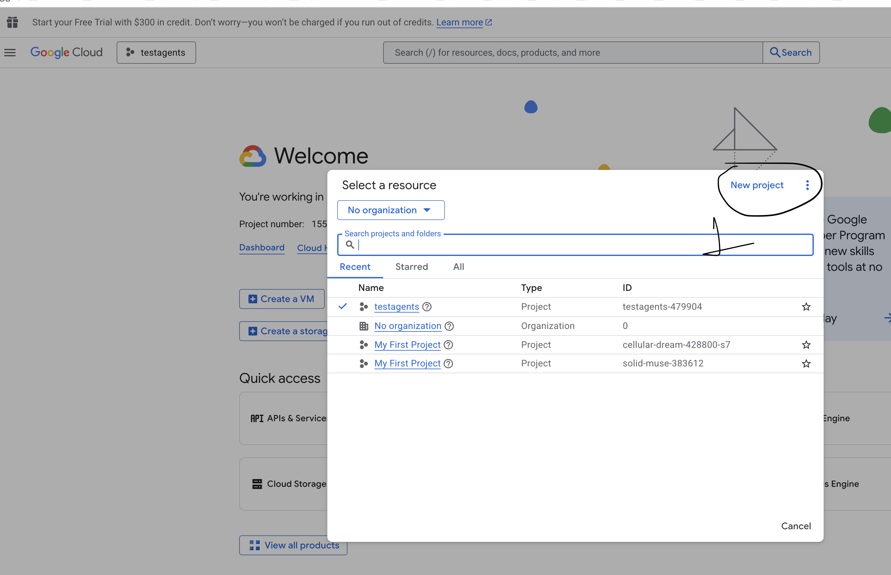
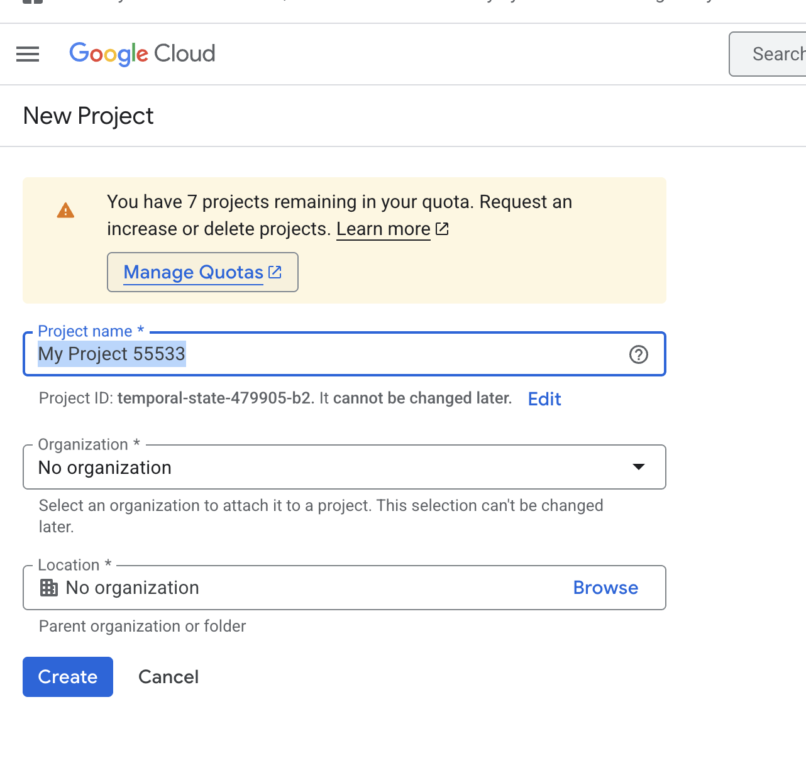
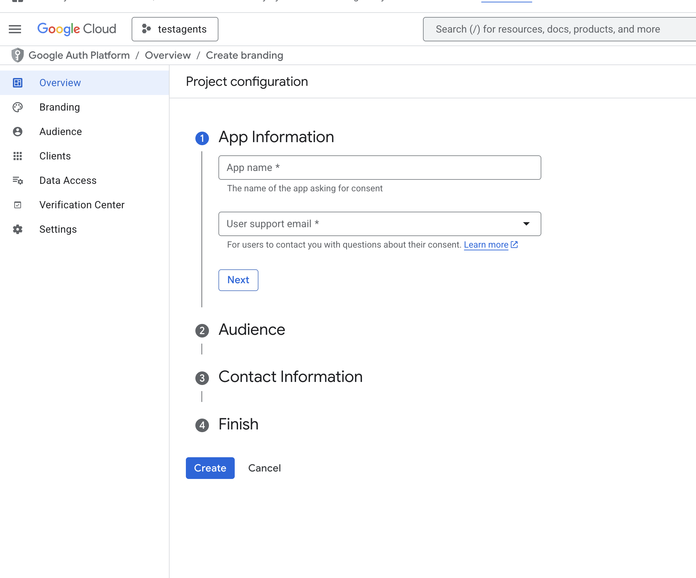
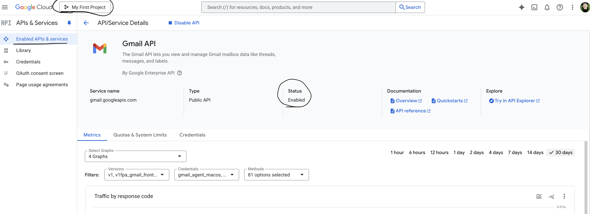
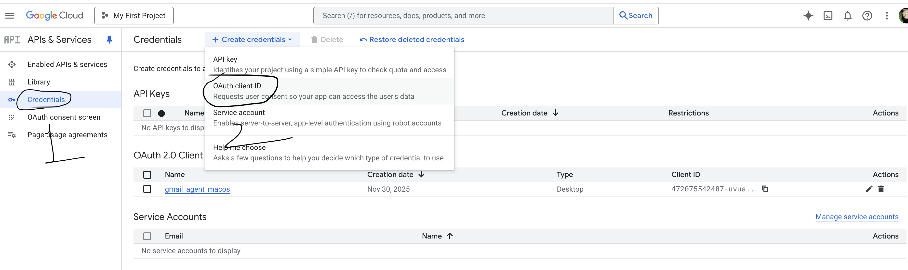
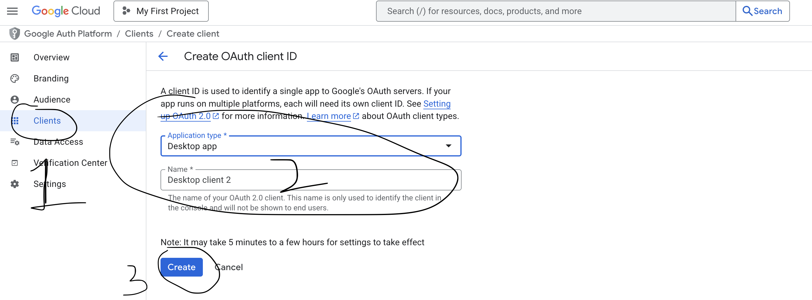
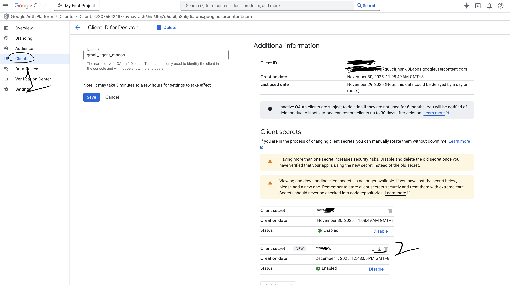
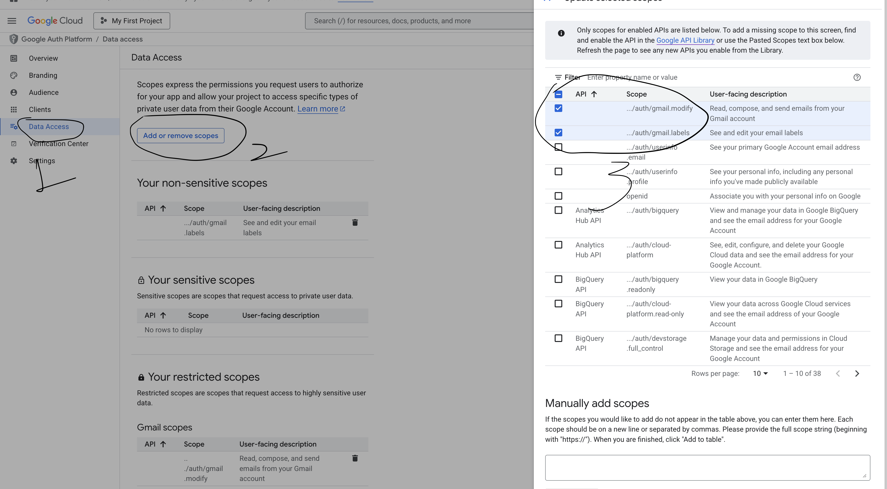

# Gmail Label Classfier

The application deals with classifying the emails in gmail using gmail API. Classifier here is LLM gpt-4o-mini that helps understanding the email subject and body to derive labels as ["Demo","Test","Job","SPAM","Education","Payments"].

### Tech Stacks

1. Google cloud - Oauth2.0 implementation 
2. Gmail API
3. Python
4. Langchain/Langgraph
5. LLM - gpt-4o-mini

## Project setup

1. Sign in to GCP and create a project as shown in the image below.

2. Fill the details required for you create the project.

3. Create a brand with your email id and other information in it.

4. Enable the Gmail API by API services "Enabled APIs and services."

5. Create a Oauth credential which will create client and a secret id. This allows your program to have access on the gmail programmatically. 

6. Fill the application type based on what kind of application it is.

7. Download the credential.json and keep in your project. A token exchange will take place when you run the code and for an authentication code you will get access token.

8. Before you run the solution, make sure the scopes of update/modification of gmail are enabled here as below.

## Working of whole project:

1. Gmail Oauth helps with the service creation.
2. Service is used to fetch the 'UNREAD' email thread id in last '2' days from 'INBOX'.
3. Once message ids are received, the messages are pulled and subject and email body are extracted.
4. Subject and email body is sent to lanngraph state to determine the label of the mail from ["Demo","Test","Job","SPAM","Education","Payments"].
5. Once label is determined, solution is supposed to remove the 'UNREAD' and 'INBOX' and add the labels classified by the LLM in above step. 